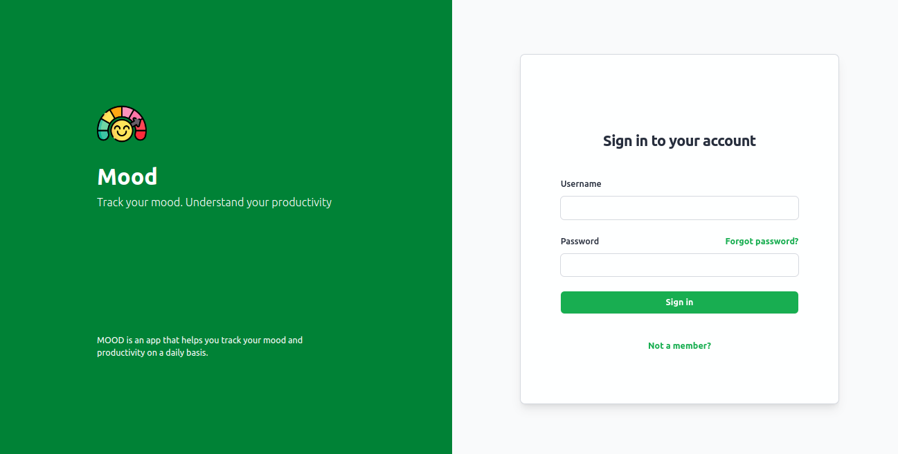
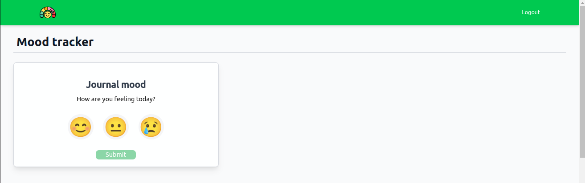
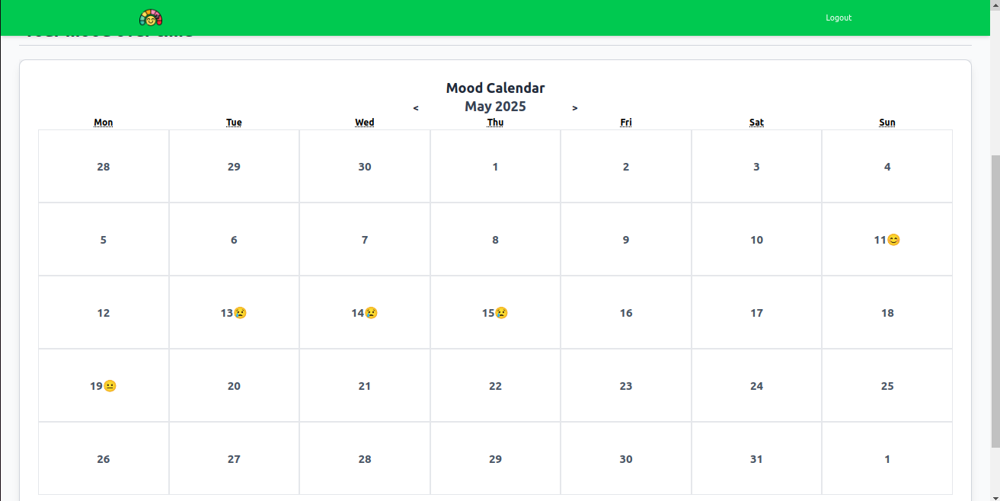

# MOOD – Application de bien-être et de productivité
 
MOOD est une application web conçue pour améliorer la productivité personnelle en commençant par l’intérieur : le bien-être émotionnel et mental.

Elle aide les utilisateurs à prendre conscience de leur humeur, à enregistrer leurs émotions, et à recevoir des suggestions quotidiennes pour se sentir mieux — avec l’ambition de s’élargir progressivement à d’autres domaines clés comme la **gestion du temps** et les **routines**.

## Objectif général  
Développer une application minimaliste qui contribue à l’épanouissement personnel et professionnel de l’utilisateur, en mettant d’abord l’accent sur la santé mentale comme base d’une productivité durable.

## Phases de développement du projet  

### Phase 1 : Humeur et santé mentale (MVP)  
- Suivi quotidien de l’humeur  
- Historique des émotions  
- Activités de bien-être simples  

### Phase 2 : Gestion du temps  
- Planificateur avec blocs horaires  
- Minuteur Pomodoro  
- Priorisation des tâches  

### Phase 3 : Habitudes et routines  
- Suivi d’habitudes quotidiennes  
- Routines personnalisées (matin/soir)  
- Système de récompenses ou gamification légère  

## Technologies utilisées

### Outils de développement & gestion
- **GitHub** : gestion de version et collaboration
- **Trello** : gestion de projet agile (sprints, tâches)
- **Notion** : documentation
- **Figma** : conception des maquettes UX/UI

### Frontend
- **React (Vite)** : framework JS pour l’interface utilisateur
- **Tailwind CSS** : framework CSS utilitaire pour un design minimaliste et rapide

### Backend
- **Django** : framework web Python robuste
- **Django REST Framework** : création de l'API REST

### Base de données
- **PostgreSQL** : base de données

## Interface de MOOD

## Phase 1 : Humeur et santé mentale (MVP)  
# Suivi quotidien de l’humeur 

Le composant **MoodSelector** permet à l’utilisateur d’enregistrer son humeur de manière intuitive en cliquant sur un emoji.
Pour garantir une expérience simple et rapide, seules trois humeurs sont proposées : happy, neutral et sad.
Une capture d’écran est jointe pour illustrer cette fonctionnalité.

# Historique des émotions

L’application inclut un composant nommé **MoodCalendar**, qui affiche l’historique des humeurs enregistrées par l’utilisateur sous forme de calendrier interactif.
Chaque jour affiche un emoji correspondant à la dernière humeur saisie.
Une capture d’écran est fournie ci-dessous pour illustrer cette fonctionnalité.

